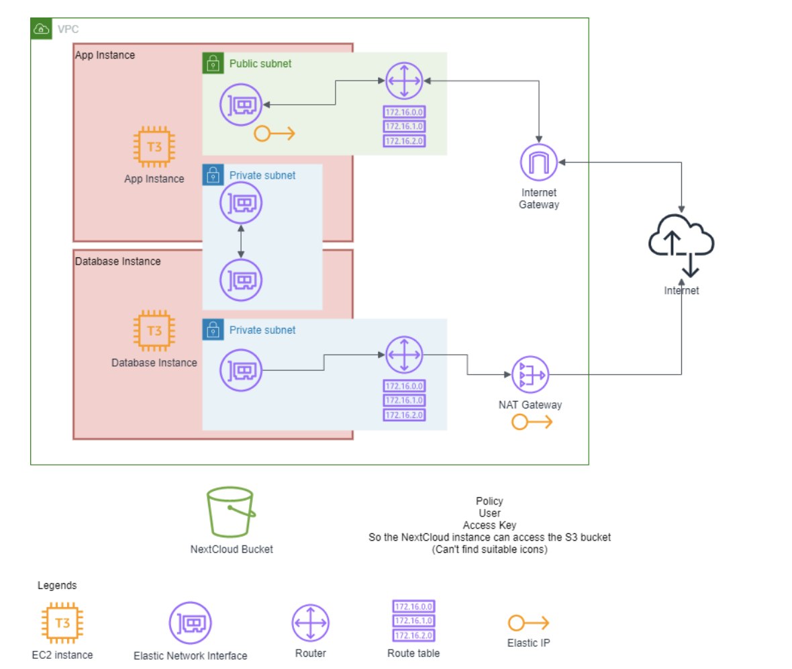

# SDS-2020-Term-project

Deploy a personal cloud storage software called NextCloud on Amazon web services using an infrastructure-as-code software called Terraform.

The config could be edit on terraform.tfvars files